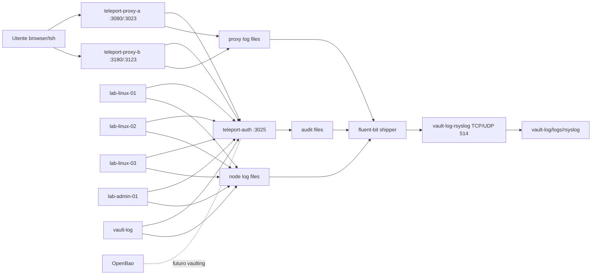

# Architettura

Teleport Auth e' l'unico componente che possiede lo storage cluster. I due proxy sono punti di accesso equivalenti allo stesso cluster e si registrano tramite token. I nodi laboratorio eseguono il Teleport node service e usano label per RBAC.

OpenBao non e' collegato automaticamente a Teleport: serve a mostrare dove potrebbero vivere segreti e password in una fase successiva.
